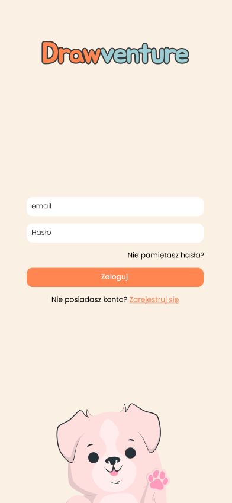
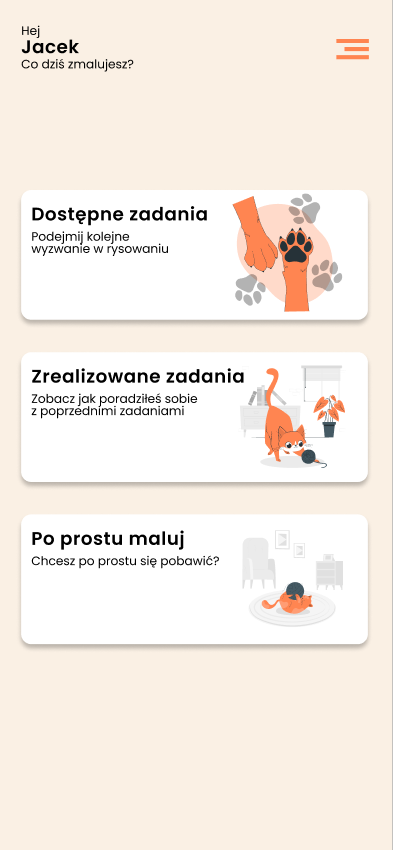
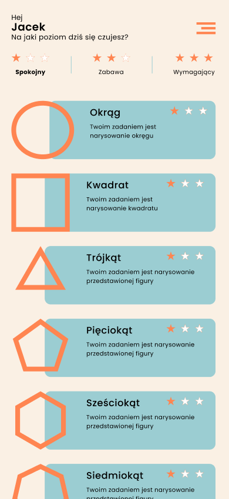
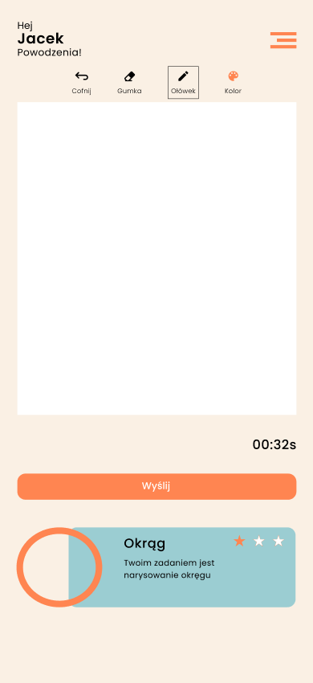
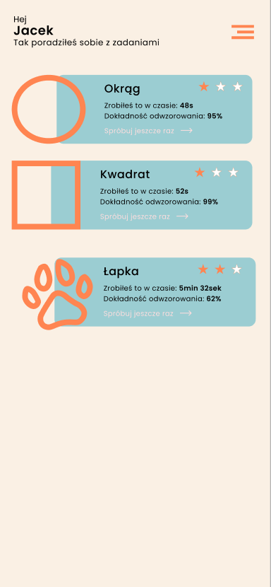

<h1 align="center">
    
</h1>

Simple game that user must draw given figure as fast and precisely as possible. AI rates drawings. Directed to kids in age at least 4+.

<p align="center">
    <a href="#features">Features</a>&nbsp;&nbsp; | &nbsp;
    <a href="#contributors">Contributors</a>&nbsp; | &nbsp;
    <a href="#getting-started">Getting started</a>&nbsp; | &nbsp;
    <a href="#screenshots">Screenshots</a>&nbsp; | &nbsp;
    <a href="#used-technologies">Technologies</a>
</p>

# Features
* user can do simple tasks - draw given figure
* tasks are divided into three levels of difficulty: easy, medium, hard
* AI (backend) rates drawings
* ability to change pen color, eraser and download drawing
* playground for non-limit drawing
* directed to kids in age 4+
* responsive layout for mobile users
* uses Firebase for storing data
* add tasks and manage user directly from Firebase
* available language: Polish (multilingual mechanism is implemented)

# Contributors
<table>
<thead>
<tr>
<th colspan="2">
Frontend
</th>
<th colspan="2">
Backend
</th>
</tr>
</thead>
<tbody>
<tr>
<td align="center">
<a href="https://github.com/amelcer">


Andrzej Melcer
</a>
</td>
<td align="center">
<a href="https://github.com/krzysztofhewelt">


krzysztofhewelt
</a>
</td>
<td align="center">
<a href="https://github.com/juliuszlosinski">


Juliusz Łosiński
</a>
</td>
<td align="center">
<a href="https://github.com/VeRonikARoNik">


VeRonikARoNik
</a>
</td>
</tr>
</tbody>
</table>

# Getting started
This app requires [Firebase](https://firebase.google.com/) database provided by Google. You can use your Google account to create database for free.

1. Clone this repo
```
git clone https://github.com/krzysztofhewelt/drawventure.git .
```

... todo ...

# Used technologies
## Frontend
* ReactJS
* Typescript
* Prettier and ESLint
* Tailwind CSS
* Firebase
* Tanstack Query (react-query)
* i18next
* react-hook-form and yup
* classnames
* react-sketch-canvas

Bundler: Vite \
IDE: WebStorm and VSCode \
Design: Figma

## Backend
* Python
* ...

# Screenshots







# Frontend TODO
- privacy policy page
- colorful timer depends on best time
- scoreboard to design and implementation
- animations
- ~~password reset pages~~
- ~~change password page~~
- ~~no tasks done information~~
- ~~improve TaskCard description for showing results~~
- ~~react-query and requests to Firebase~~
- ~~loading view~~
- ~~error pages (404, 500, ...)~~
- ~~fix Header pageNames match with params route~~
